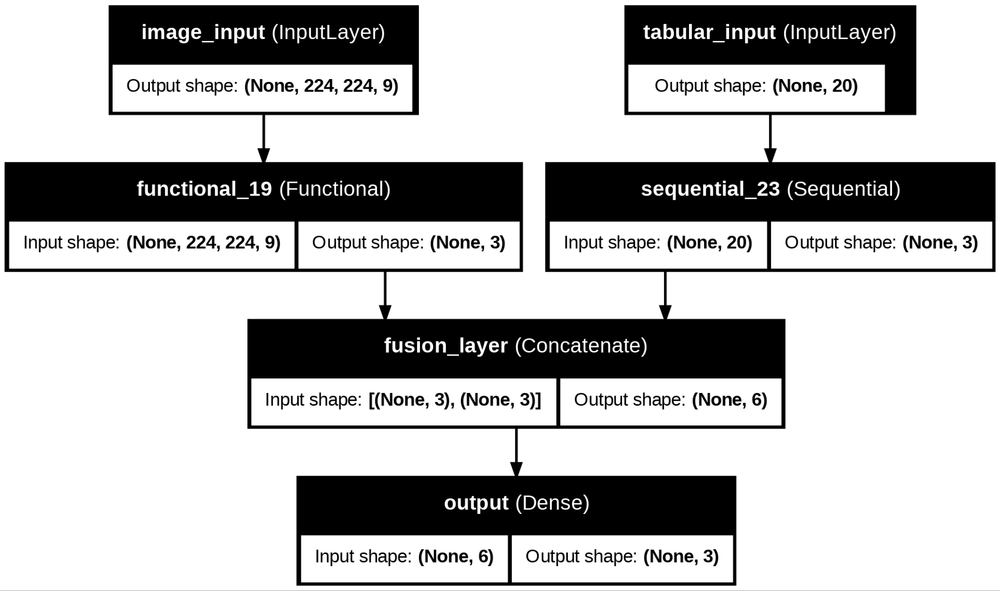

# Multimodal Cardiac MPI Classification


---

## Overview

This project implements a multimodal deep learning system that combines cardiac SPECT imaging and clinical tabular data to classify myocardial perfusion conditions:

* Normal
* Ischemia
* Infarction

Rather than relying on imaging alone, the system integrates heterogeneous data sources to improve robustness and detection performance.

### Performance Impact

| Model              | Accuracy   |
| ------------------ | ---------- |
| CNN (Images Only)  | 96.15%     |
| ANN (Tabular Only) | 91.03%     |
| **Fusion Model**   | **97.44%** |

Multimodal fusion improved overall accuracy and enabled detection of infarction cases missed by alternative strategies.

---

## Model Architecture



Two independent branches process different modalities before merging predictions.

### Image Branch

* 9-channel stacked SPECT representation
* Channel reduction via 1×1 convolution
* Fine-tuned ResNet50 backbone
* Dense classifier

### Tabular Branch

* 20 selected clinical features (through ANOVA)
* Fully connected network
* Encoded and normalized inputs

### Fusion

* Weighted late fusion (selected)
* Meta-learning stacking (evaluated)

---

## Pipeline Overview

```
Raw SPECT Images ──► Cropping ──► Augmentation ──► Channel Stacking
                                               │
                                               ▼
                                          ResNet50
                                               │
Clinical Metrics ──► Cleaning ──► Selection ──► ANN
                                               │
                                               ▼
                                       Prediction Fusion
                                               │
                                               ▼
                                     Cardiac Classification
```

---

## Dataset Snapshot

* 97 SPECT MPI cases
* 3 cardiac condition classes
* Severe class imbalance
* 45 extracted metrics → 20 selected features

Dataset excluded due to restrictions.

---

## Engineering Highlights

* Multimodal architecture design
* Transfer learning with selective unfreezing
* Custom medical image tensor construction
* Manual clinical feature extraction
* Small dataset generalization strategies
* Hyperparameters chosen after ablation analysis 

---

## Running the Notebook

1. Clone repository
2. Open notebook
3. Execute cells sequentially

Replace dataset paths with your own data. Again, original dataset is excluded due to restrictions.

---

## Author

Academic research project exploring multimodal deep learning in medical imaging.
